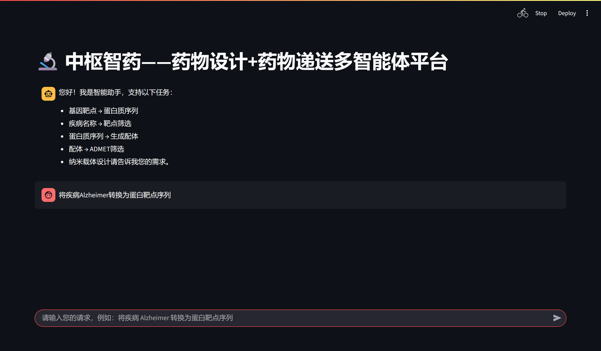

# 🔬CentraPharma



CentraPharma is an integrated engineering repository for **AI-driven drug design** and **drug delivery system design**. It combines:

- GPT-based ligand generation (DrugGPT)
- Disease/gene → protein sequence conversion tools
- Batch ADMET filtering workflows
- Nanocarrier system design (LNP / Liposome / NLC / PLGA), structure building, minimization, and scoring
- A Streamlit + AutoGen multi-agent interface

---

## 📝Repository Structure

```text
CentraPharma/
├── eng/
│   ├── autogen_bridge/      # Multi-agent orchestration + Streamlit app
│   ├── druggpt/             # DrugGPT generation model and inference scripts
│   ├── druggpt_bin/         # Model weights (need to be downloaded from hugging-face)
│   ├── data/                # Disease-target and target-sequence source data
│   ├── data_preprocessing/  # Data preprocessing scripts
│   ├── delivery_pipeline/   # Delivery design, structure generation, MD/scoring pipeline
│   └── LNP/templates/       # Delivery system templates
└── env/
    ├── environment.yml      # General agent environment
    ├── AmberTools25.yml     # AmberTools-focused environment
    └── README.md            # Environment setup details
```

---

## 🤖Core Capabilities

### 1) Ligand Generation with DrugGPT
- Input either a FASTA file or a raw amino-acid sequence
- Optional ligand prompt support
- Batch generation of candidate molecules
- Sampling and atom-count controls (temperature / top-k / top-p / atom limits)

Primary script: `eng/druggpt/drug_generator.py`

### 2) Disease/Gene to Protein Sequence Conversion
- `disease_to_protein_sequences`: finds disease-related targets and exports FASTA
- `gene_target_to_protein_sequence`: resolves a gene target to protein sequence

Primary script: `eng/autogen_bridge/tools.py`

### 3) ADMET Filtering
- Reads generated molecule outputs
- Runs batch ADMET prediction
- Filters by BBB, QED, logP, TPSA, hERG, and AMES constraints

Primary script: `eng/autogen_bridge/tools.py`

### 4) Delivery System Design and Evaluation
- Enumerates delivery designs from candidate molecules and material strategies
- Builds Packmol inputs and structures
- Optionally runs Amber/OpenMM preparation and minimization
- Scores designs from material, structure, and MD metrics

Primary script: `eng/delivery_pipeline/pipeline.py`

### 5) Multi-Agent App (Streamlit)
Natural-language task routing for:
- Disease name → protein targets
- Gene target → protein sequence
- Protein sequence → ligand generation
- Ligands → ADMET filtering
- Nanocarrier design

App entrypoint: `eng/autogen_bridge/streamlit_app.py`

---
## 🕹️Hardware Requirements
This project requires an NVIDIA GPU such as an RTX 3090, V100, or better.

---
## 🛠️Environment Setup

Please follow the detailed instruction in `env/README.md`
Then download the Model weights for Druggpt with the link provided in `eng/druggpt_bin`

---

## 🚩Quick Start

Launch the multi-agent web app
```bash
conda activate agent
cd eng/autogen_bridge
streamlit run streamlit_app.py
```
Then open the local URL shown by Streamlit.

---

## 🗃️Model Files

For DrugGPT model download instructions, see:
- `eng/druggpt_bin/README.md`

Example command:
```bash
hf download liyuesen/druggpt --revision main --local-dir .
```

---

## 📚Data

Sample source data under `eng/data/` includes:
- `P1-06-Target_disease.txt`: disease-target relationships
- `P2-06-TTD_sequence_all.txt`: target protein sequences

These files support disease → target → sequence workflows.

---

## ⚙️Troubleshooting

1. **Streamlit app cannot call the model backend**  
   Make sure `ollama serve` is running and `qwen3:8b` has been pulled.

2. **DrugGPT fails to generate SDF files**  
   Check that OpenBabel (`obabel`) is installed and available in `PATH`.

3. **Delivery pipeline cannot find template files**  
   Verify the template directory configuration (default: `eng/delivery_pipeline/template`).

---

## 💌Acknowledgements

This project builds upon and benefits from the following open-source projects:

- [pkasolver](https://github.com/mayrf/pkasolver)
- [DrugGPT](https://github.com/LIYUESEN/druggpt)

We gratefully acknowledge the authors and contributors for their valuable work, which has supported the development of this project.
